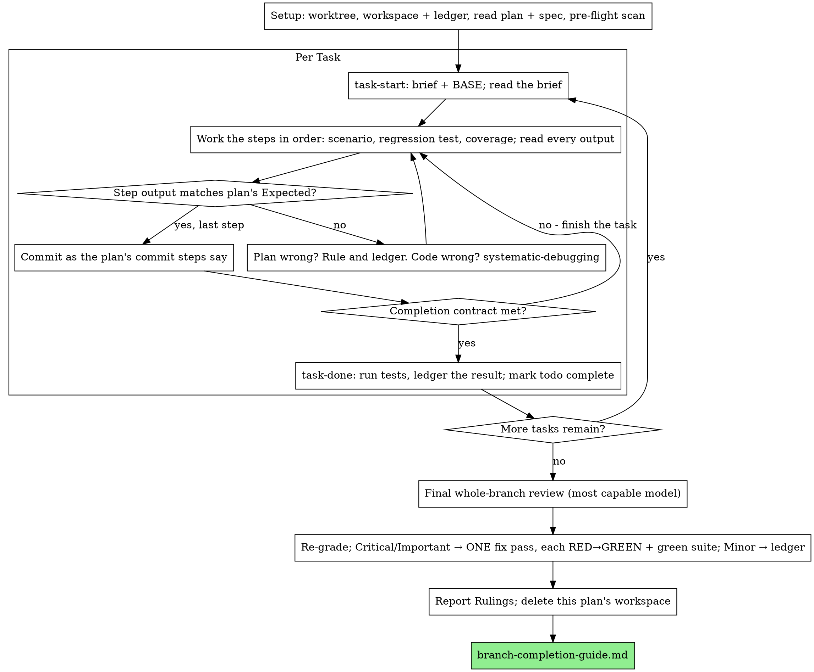

# Executing Plans (Inline)

Adapted from obra/superpowers `executing-plans` (MIT).

Execute the plan yourself, task by task, in this session: no implementer subagent per task, no reviewer per task. One fresh-context review of the whole branch at the end.

**Why Inline:** `development:subagent-driven-development` pays for a fresh implementer and a fresh reviewer on every task, each re-reading the codebase from zero. Inline execution pays for one context (yours) plus one reviewer at the end. It keeps what the per-task seats bought by other means: the brief is the spec, the ledger is your memory, scenario-driven development (scenario by hand, then regression test, then coverage) is the per-task gate, and the final reviewer is the second pair of eyes.

**Core principle:** the plan already did the thinking. Execute it exactly, prove each step with a test you watched fail and then pass, and leave a record that survives your own forgetting.

**Narration:** between tool calls, narrate at most one short line. The ledger and tool results carry the record.

**Continuous execution:** do not pause to check in with the user between tasks. They chose Inline to spend less, not to answer "should I continue?" after every task. Execute every task without stopping.

**Rulings, not stalls.** Conflicts, ambiguities, plan defects — decide them. The spec is the binding authority, the plan is its argument, and your judgment settles what neither answers. Record every decision in the ledger as `Ruling: <what you decided> — <why> — <cost if wrong>` (the form in [`development/skills/agile-development/reference/worker-contract.md`](../skills/agile-development/reference/worker-contract.md)) and keep going. Deviating from the plan without a ledgered ruling is a decision made in secret.

**Four things stop you, and only these:** an irreversible or destructive operation; a security-sensitive action; a side effect outside this worktree that norms say you ask about first (a merge, a push to a shared branch, a publish, a message to anyone but the user); and a plan so broken that every path forward is a guess. For those, stop and ask.

## When to Use

- You have a plan from [`writing-plans-guide.md`](writing-plans-guide.md) and the user chose **Inline** at the Execution Handoff.
- Your harness has no subagent tool. Never fabricate a dispatch; run the plan here.
- The task list is coupled or sequential, so a fresh subagent per task would keep re-reading shared context. `development:implement` routes such lists here.
- Or the user chose inline execution, or no subagent tool is available.

A fully specified plan makes Inline execution transcription plus testing: it runs well on a mid-tier session model. The one place the most capable model earns its cost is the final review, which this guide dispatches separately.

Prefer `development:subagent-driven-development` when the user wants a review gate on every task, or when the plan is long enough that its later tasks would run on a compacted context. Inline over a long plan still works — the ledger makes it recoverable — but the last tasks get the least of you.

## Scripts

Inline execution shares its workspace, ledger, and helpers with subagent-driven development. The helpers live in [`../skills/subagent-driven-development/scripts/`](../skills/subagent-driven-development/scripts/) (`<sdd-scripts>` below). Invoke them through `bash`; they are POSIX bash and need `git`.

- `bash <sdd-scripts>/sdd-workspace PLAN_FILE` — prints this plan's git-ignored workspace, `<repo-root>/.sdd/<plan-basename>/`.
- `bash <sdd-scripts>/task-start PLAN_FILE N` — writes Task N's brief; prints `brief: <path>` and `base: <sha>`.
- `bash <sdd-scripts>/task-done PLAN_FILE N BASE -- <test cmd>` — runs the tests, logs full output, and appends the completion line only on success.
- `bash <sdd-scripts>/review-package PLAN_FILE BASE HEAD` — writes commits, stat, and diff to one file for the final reviewer.

## The Process



## Setup

Work in an isolated branch or worktree ([`git-worktrees-guide.md`](git-worktrees-guide.md)). Never start implementation on main/master without the user's explicit consent.

Conversation memory does not survive compaction. An inline executor that loses its place re-implements tasks whose commits already exist. Track progress in a **ledger** file, not only in todos: todos are a live view; the ledger is the record.

The workspace and ledger are the same ones subagent-driven development uses — same directory, same format — so a plan can switch executors mid-flight and the new one resumes from the same ledger.

- **Workspace.** Run `sdd-workspace PLAN_FILE`. The printed directory holds every artifact for THIS plan. Another plan's directory is never yours to read or write.
- **Resume.** Check `<workspace>/progress.md`. If its first line names your plan file, every task with a `Task <N>: complete` line is DONE — do not redo it; resume at the first task without one. After compaction, trust the ledger and `git log` over your own recollection. A ledger naming a different plan is another plan's progress; leave it.
- **Create** the ledger with its identity as the first line: `# SDD ledger — plan: <plan file path>` (`task-done` also creates it if missing).
- `git clean -fdx` destroys the workspace (git-ignored scratch). If that happens, recover from `git log`.

Read the plan once, note its context and Global Constraints, and create a todo per task. If the plan names a `Spec:`, read it too: conflicts inside the plan resolve against the spec. A plan with no reachable spec gets a ledger note saying so — rulings made without one are provisional.

**REQUIRED SUB-SKILL:** load `development:scenario-driven-development` now, before Task 1. It governs every step of every task: run the scenario by hand, then add the regression test that fails when the change is reverted, then check coverage on the changed code. A plan whose steps already spell this out does not exempt you from reading it. Use `development:test-driven-development` only when the user explicitly asks for TDD (opt-in), and then switch as that skill's "When the user asks for TDD" section says: the failing test comes first, and the scenario, coverage, and speed rules still apply.

**Pre-flight conflict scan.** Before Task 1, scan for conflicts between tasks. The plan's Interfaces blocks tell you where to look: for every task that consumes what an earlier task produces, one ledger row — the two tasks, what one produces against what the other consumes, and what you found. Tasks that share nothing get no row; a plan whose tasks share nothing gets the single line `Pre-flight: no shared interfaces`. Rule on each conflict with the spec as the binding authority, record the ruling beside its row, and start Task 1. Each task's own text is checked when you read its brief.

## The Task Loop

Everything you print, and every tool result, stays resident in your context for the rest of the session. Redirect long test output to a file in the workspace and read its tail; read a brief, not the whole plan. Every tool call is a turn that re-reads your whole context, so bookkeeping rides along with work — a ledger append in the same call as the commit, never in a call of its own.

### 1. Take the task

- Run `task-start PLAN_FILE N`. Read the brief for every task, including ones you remember from setup: you remember a summary; the brief has the exact values, signatures, and test cases.
- Mark the task's todo in_progress.

### 2. Work the steps

The plan's steps are already in scenario-driven order; follow them under `development:scenario-driven-development`. The scenario runs by hand before any test is written, and its verdict (pass, fail, or blocked) is recorded with evidence — a scenario that could not run is not a pass. Each regression test is shown failing once with the change reverted — a test that still passes with the change reverted is a finding about the test. Tests stay fast: each under 1 second, the focused suite under 30 seconds.

Every step that runs a command has an `Expected:` line. Run it, read the output, compare. Three outcomes:

- **Matches.** Next step.
- **The code is wrong.** Use `debugging:systematic-debugging`. Find the cause; never patch the symptom to make the output match. The contract's fix budget applies to the same failure: after three failed fix attempts, stop fixing and re-plan the task (ledger what was learned and the new approach as a Ruling).
- **The plan is wrong** — a step contradicts the spec, an interface from an earlier task does not match what this task consumes, a command that cannot work. Rule on the smallest change that satisfies the spec, ledger it as `Task <N>: Ruling: <finding> — <decision> — <cost if wrong>`, and continue. The ruling is carried, not remembered: later tasks touching the same interface read it from the ledger.

Commit as the plan's commit steps say. A task that spans several commits is fine; BASE is what the review range is cut from, never `HEAD~1`.

### 3. The completion contract

Before a task's ledger line, all of these are true, with evidence in this session — not inferred from the diff looking right:

- Every scenario the brief names ran by hand with a recorded verdict, and every test it names exists, ran in this task, and you read the output.
- Each new regression test was seen failing with its change reverted, and coverage on the changed code was checked (each uncovered risky line has a test or a one-line reason).
- The final test run for the task passed — `task-done` is that run, and it writes the command and result into the ledger line.
- Every `Expected:` line in the brief was compared against real output.
- Every deviation from the brief has a `Ruling:` line in the ledger.

**REQUIRED SUB-SKILL:** `development:verification-before-completion` governs the claim. If any item is missing, the task is not complete: finish it.

### 4. Complete the task

**`task-done` is the only way to record completion.** Never hand-write a `Task <N>: complete` line. Run:

`bash <sdd-scripts>/task-done PLAN_FILE N BASE -- <test command>`

with the test command the brief names for the whole task (the project's whole suite when the brief says so). It runs the tests, keeps the full output in the workspace, prints the tail, and — only if they pass — appends:

`Task <N>: complete (commits <base7>..<head7>, tests: <command> → <result>)`

A failing run records nothing; the task is not complete. When it records, mark the todo complete and take the next task.

## Final Review

Run `review-package PLAN_FILE MERGE_BASE HEAD` (MERGE_BASE = the commit the branch started from, e.g. `git merge-base origin/main HEAD`).

**With a subagent tool:** dispatch ONE whole-branch review — the `code-reviewer:code-reviewer` agent (it applies `code-reviewer:pr-review`) — **on the most capable available model**, stated explicitly (an omitted model inherits the session's, which may not be the most capable). Give it the package path, the plan and spec paths, the plan's Review Focus section verbatim (the input classes and failure modes the plan's tests do not exercise — the reviewer checks each deliberately), and a pointer to the ledger's `Ruling:` lines so it can weigh the calls you made. This is the one fresh context the whole run buys. Do not skip it, and do not replace it with your own read of the diff.

**Without a subagent tool:** perform that review yourself against the package, following `code-reviewer:pr-review`, as a separate pass after the last task's ledger line. Write `Final review: self-review (no subagent tool)` to the ledger and say so in your final message: a self-review by the author is weaker than a fresh reviewer, and the user decides whether that is enough before merge.

Sort the findings before acting on any of them. The reviewer's severity labels are advice; the gate is yours. Its "Declined to judge" list is yours too: each line is a ruling you make and ledger — `Final: Ruling: <behavior the reviewer set aside> — <what a reasonable person using this software gets, and why that stands or is now a finding> — <cost if wrong>`. Re-grade first, by effect: a finding's grade is what a reasonable person using this software gets if it ships, not whether the spec names the input that triggers it. Then:

- **Critical and Important** enter the fix pass.
- **Minor** goes to the ledger as `Final: minor (deferred): <one-liner>` and to your final message under "Deferred minors". Minors never enter the fix pass and never become rulings.

Fix the Critical and Important findings yourself, in ONE pass. Each fix follows the bug-fix order of `development:scenario-driven-development`, not a second reviewer: reproduce the finding by hand, reproduce it in code with a failing test, fix until green, re-run the manual scenario, then run the whole suite. Record each as `Final: fixed <finding> — <test name> RED→GREEN, suite <N>/<N>`. A fix without a test that failed first is not verified; a suite that is not green means the pass is not over. Do not dispatch a re-review: the covering tests already answer "addressed" and the suite run answers "broke nothing".

A finding you decide not to fix is a ruling — `Final: Ruling: <finding> — <why the code stands> — <cost if wrong>` — and reaches the user in the rulings list. There is no second fix pass.

## Finish

Before deleting anything, collect every ledger line containing `Ruling:` into your final message under **"Rulings I made"**, in order, each with its cost if wrong, and every `minor (deferred)` line under **"Deferred minors"**. Both lists are exhaustive. Your final message is the only place the decisions you took on the user's behalf — and the findings you chose not to act on — reach them.

When the final review is clean and its fixes are committed, delete this plan's workspace directory — git history is the record now. Sibling directories belong to other plans; leave them alone.

Then follow [`branch-completion-guide.md`](branch-completion-guide.md): verify tests, present the options, execute the user's choice.

## Common Rationalizations

| Excuse | Reality |
| --- | --- |
| "I remember what Task N says" | You remember a summary. The brief has the exact values. Read it. |
| "The plan's code is right, skip the manual scenario" | Tests passing is not the feature working. Run the scenario by hand and record the verdict. |
| "The regression test passes, skip reverting the change" | A test you never saw fail proves nothing. Revert, watch it fail, restore. |
| "I'll run the full suite at the end instead of per step" | Per-step runs show which step broke it. The end-of-task run is the contract, not a substitute. |
| "The plan is wrong here, I'll just do the right thing" | Do the right thing and ledger the ruling. Unledgered deviation is a decision made in secret. |
| "I'll write the ledger lines after a few tasks" | Compaction does not wait. One line per task, via `task-done`, in the same message as the commit. |
| "Tests passed earlier, I'll write the complete line by hand" | `task-done` is the only way to record completion. A hand-written line is a claim without a run. |
| "Let me check in before the next task" | They chose Inline to spend less. Only the four stops stop you. |
| "I read my own diff carefully; the final reviewer is redundant" | Same author, same blind spots. The reviewer is the only fresh context this run buys. |
| "Tests should pass, the change was trivial" | "Should" is not evidence. The contract requires the command and its output. |
| "Subagents are expensive, I'll skip the final review too" | Inline already removed per-task reviewers. One whole-branch review is the floor. |
| "The reviewer said Minor, so it's Minor" | The label graded the spec's silence. Grade what the person gets. Re-grade, then gate. |
| "The fix is obvious, no need for a failing test first" | The failing test is the only proof the finding was real and is now gone. |
| "I'll fix the minors too while I'm in there" | Each minor is a test, a fix, and a suite run nobody asked for. Ledger them; the user decides. |

## Example Workflow

```text
You: I'm executing this plan Inline.

[Worktree verified; plan + spec read once]
[sdd-workspace docs/plans/feature-plan.md → no ledger, fresh start]
[Pre-flight: 2 shared-interface rows, clean; written to ledger]

Task 1: Hook installation script
[task-start plan 1 → brief read; BASE a1b2c3d]
[Step 2: run the scenario by hand — hook installed, exit 0. Verdict: pass. Matches Expected.]
[Step 3: regression test — PASS 1/1; change reverted → FAIL; restored → PASS. Matches Expected.]
[Step 4: coverage on changed lines — error path uncovered → one test added. Commit d4e5f6a]
[task-done plan 1 a1b2c3d -- npm test -- hooks → ledger: Task 1: complete (commits a1b2c3d..d4e5f6a, tests: npm test -- hooks → 1/1 pass)]

Task 2: Recovery modes
[task-start plan 2 → BASE d4e5f6a]
[Step 2: FAIL on an import error: Task 1 exports installHook, brief consumes install_hook]
[Ledger: Task 2: Ruling: install_hook → installHook — matches Task 1's Interfaces — cost if wrong: one rename]
[Steps continue; commit b7c8d9e; task-done → Task 2: complete (...)]

...

[review-package plan MERGE_BASE HEAD; code-reviewer:code-reviewer, model: opus]
Reviewer: one Important (hardcoded interval), two Minor.
[Fix pass: test_progress_interval_configurable RED → GREEN; suite 12/12; commit]
[Ledger: Final: fixed hardcoded interval — test_progress_interval_configurable RED→GREEN, suite 12/12]

Rulings I made:
- Task 2: install_hook → installHook — brief typo — cost if wrong: one rename

Deferred minors:
- README lacks a usage example

[Delete this plan's workspace; follow branch-completion-guide.md]
```

## Integration

- **Plan source:** [`writing-plans-guide.md`](writing-plans-guide.md).
- **Workspace:** [`git-worktrees-guide.md`](git-worktrees-guide.md).
- **Per-step discipline:** `development:scenario-driven-development`, `debugging:systematic-debugging`, `development:verification-before-completion`.
- **Shared ledger and scripts:** `development:subagent-driven-development`.
- **Rulings and fix budget:** [`worker-contract.md`](../skills/agile-development/reference/worker-contract.md).
- **Final review:** `code-reviewer:code-reviewer` agent / `code-reviewer:pr-review`.
- **Finish:** [`branch-completion-guide.md`](branch-completion-guide.md).
