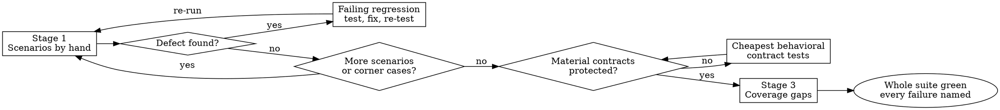

# Scenario-Driven Development

**Primary objective:** Prove the user workflow by hand before locking behavior into regression tests.
**Decision rule:** For relevant cases these steps do not cover, choose the next in-scope action that advances this objective; preserve explicit scope, safety, and output requirements.

The default way to prove a change works. Three activities, with manual testing starting as soon as the first tiny slice runs:

1. **Scenario manual testing** — keep testing each runnable slice the way a user uses it.
2. **Regression and contract tests** — reproduce real defects before fixing them, then protect stable material acceptance behavior.
3. **Coverage-guided tests** — only after all scenarios and corner cases pass by hand, find risky untested changed code and add the fewest useful tests.

Tests are fast. TDD (`development:test-driven-development`) is opt-in: use it only when the user explicitly asks for TDD.

**Core principle:** Observed-bug regression tests have first claim on the test budget. Manual scenarios find real breaks; automated behavioral tests protect material acceptance contracts; coverage finds risky behavior nobody exercised. Do not mirror every passing scenario with its own test.

## Flow

### Stage 1 — Scenario manual testing

- The Manual Tester and Developer choose the smallest useful first scenario together. Expose its entry point and expected observation immediately; test it while the next slice is built. Keep only enough scenario notes to run the current path.
- Choose the shortest existing consumer path that proves the whole scenario: an available app browser or Playwright for a web page; a small HTTP script for a web API; or a disposable driver calling public functions for a library. If a backend feature is reachable through an existing UI or API, test it there when that gives stronger scenario evidence without substantial setup. CDP can connect Playwright to an existing Chromium browser; it is optional, not a prerequisite. A manual driver invokes real behavior rather than mocking the core or accumulating unit cases.
- Turn the remaining acceptance criteria into scenarios as work advances. Walk each as **entry → action → result → destination → aftermath**. Add the **empty, boundary, error, and re-entry** states and other material corner cases.
- Every scenario needs an entry point: a CLI command, endpoint, simulator, script, or UI path. No entry point → add one first. Making the change reachable is part of the work. If the entry point would fall outside the files you own, drive the code from a throwaway script in the scratchpad, or return NEEDS_CONTEXT.
- Run each scenario by hand. Record the command, output, screenshots, and structured logs.
- Verdict per scenario: **pass**, **fail**, or **blocked**. A scenario that could not run is never a pass: it is **fail** when the product is at fault, **blocked** when the environment is (outage, missing access).
- Diagnose failures from structured logs, not guesses. Use the project's logger; add JSONL logging only where you are diagnosing, and do not bootstrap a logging stack inside an unrelated task. See [reference/instrumented-logging.md](reference/instrumented-logging.md) and `debugging:debug-with-logs`.
- Each observed defect gets a minimal reproduction, a failing regression test, a fix, and a manual re-run of the affected and nearby paths. Continue testing new slices while the feature is built.

### Stage 2 — Regression tests

Start when manual testing finds an actual defect or establishes stable material acceptance behavior. Do not prewrite a catalogue of guessed test cases.

- Every observed defect gets one focused test at the **cheapest layer that still reproduces the real failure**. Watch it fail before the fix and pass afterward. If the test was written after the fix, demonstrate that it **fails when its fix is reverted**; restore the fix and see it pass. Never revert with `git checkout`, `git stash`, or `git reset` over uncommitted work.
- After behavior stabilizes, every material acceptance contract gets at least one automated behavioral test at the cheapest layer that proves it. One test may protect several contracts; do not create one test per manual scenario.
- One test per behavior. Name the production change that would make it fail before you write it. Rules: [reference/writing-good-tests.md](reference/writing-good-tests.md).

**Bug fixes** follow this order:

1. **Reproduce by hand** — walk the failing scenario; capture output and logs.
2. **Reproduce in code** — a failing test that shows the same wrong result.
3. **Fix until green** — the smallest change that makes that test pass.
4. **Re-run the manual scenario** — the user-visible symptom is gone.

For a bug whose cause is unclear, run `debugging:systematic-debugging` before step 3.

### Stage 3 — Coverage-guided tests

Start only after **all** acceptance scenarios and material corner cases have been manually verified, including simulator paths where needed.

- Run coverage on the changed code with the language's own tool. Commands per stack, including C# (`XPlat Code Coverage`, `dotnet-coverage`): [reference/coverage-tools.md](reference/coverage-tools.md).
- List uncovered changed lines and branches. Rank by risk: error paths, boundaries, security, data loss first.
- Add the fewest tests that cover the most risky surface. One test that walks a whole branch beats three that each touch one line. Prefer a real-bug regression over a coverage-only test when both compete for time.
- **No % target.** Each uncovered changed line left behind gets one line of reason: unreachable, trivial, or covered by a manual-only scenario.
- No coverage tool available → say so, and review the changed lines by hand against the tests.

## When the user asks for TDD

TDD is opt-in: switch only when the user explicitly asks for TDD, and carry that ruling to every worker (in the brief or `[RULINGS]`). Then `development:test-driven-development` replaces Stage 2's order:

- New behavior gets a failing test before production code. The reviewer checks red-before-green evidence instead of tests-after order.
- In Agile team mode, an explicit TDD request allows tests for new behavior before manual testing. The Manual Tester's thumbs-up is still required before the slice is done.
- Stage 1 scenarios, Stage 3 coverage, the speed budgets, and the whole-suite rule still apply.

## Speed budgets

- Each new test runs in **under 1 second**.
- The focused suite for a change runs in **under 30 seconds**.
- No sleeps, no real network, no shared mutable state between tests.
- A slower test is marked integration (the project's tag, category, or folder) and carries a one-line reason.
- A test over budget is a design signal: fake the slow dependency at its boundary, or move the check to a cheaper layer.

## Green means the whole suite

While iterating, run the focused tests. Before calling the change done, run the project's whole test command even when the task named one file. Report every failure by name, including ones you didn't cause.

## Report

For each change, report:

- **Scenarios:** each one, its verdict, and its evidence (command → observed result).
- **Defects:** each one, its fix, and its regression test (with failure before the fix, or with the reverted-fix failure seen).
- **Contracts:** each material acceptance contract and the automated behavioral test that protects it.
- **Coverage:** tool and command, uncovered changed lines left, one reason each.
- **Speed:** slowest new test; focused suite time.
- **Suite:** whole-suite command and result, failures by name.

## Red flags

| Thought | Reality |
|---|---|
| "Tests pass, so it works" | Tests prove what they check. Walk the scenario by hand first. |
| "I'll plan tests for every passing scenario" | Protect material acceptance contracts, not a catalogue of interaction variants. One behavioral test may cover several scenarios. |
| "Couldn't run it, but the code looks right" | Not run = not passed. Mark it fail or blocked. |
| "Coverage is 90%, good enough" | No % target. Only the changed, risky lines matter. |
| "Add a test for every uncovered line" | Fewest tests, most surface. Justify the rest in one line. |
| "The fix works, no need to see the test fail" | A regression test never seen failing may not catch the regression. Revert once. |
| "This test needs a 2-second sleep" | Over budget. Fake the clock or wait on the condition. |

## Related

- `development:test-driven-development` — opt-in, only when the user explicitly asks for TDD.
- `development:verification-before-completion` — evidence before claiming done.
- `debugging:systematic-debugging`, `debugging:debug-with-logs` — root cause before fixes.
