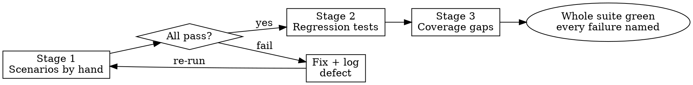

# Scenario-Driven Development

The default way to prove a change works. Three stages, in order:

1. **Scenario manual testing** — prove it works the way a user uses it.
2. **Regression tests** — lock in what manual testing proved, at the cheapest layer.
3. **Coverage-guided tests** — find untested changed code; add the fewest tests that cover the most.

Tests are fast. TDD (`development:test-driven-development`) is opt-in: use it only when the user explicitly asks for TDD.

**Core principle:** A test earns its place by catching a real break. Manual scenarios find the breaks; regression tests keep them fixed; coverage finds what nobody looked at.

## Flow

### Stage 1 — Scenario manual testing

- Turn each acceptance criterion into scenarios. Walk each as **entry → action → result → destination → aftermath**. Add the **empty, boundary, error, and re-entry** states.
- Every scenario needs an entry point: a CLI command, endpoint, script, or UI path. No entry point → add one first. Making the change reachable is part of the work. If the entry point would fall outside the files you own, drive the code from a throwaway script in the scratchpad, or return NEEDS_CONTEXT.
- Run each scenario by hand. Record the command, output, screenshots, and structured logs.
- Verdict per scenario: **pass**, **fail**, or **blocked**. A scenario that could not run is never a pass: it is **fail** when the product is at fault, **blocked** when the environment is (outage, missing access).
- Diagnose failures from structured logs, not guesses. Use the project's logger; add JSONL logging only where you are diagnosing, and do not bootstrap a logging stack inside an unrelated task. See [reference/instrumented-logging.md](reference/instrumented-logging.md) and `debugging:debug-with-logs`.
- Each defect found here gets fixed, logged by name, and its scenario re-run.

### Stage 2 — Regression tests

Start only after the scenarios pass by hand. One exception: the bug-fix order below writes its reproducing test before the fix, on purpose.

- Lock each passing scenario at the **cheapest layer that still proves it**: unit over integration over end-to-end.
- Every Stage 1 defect gets a test that **fails when its fix is reverted**. Show that failure once: edit the fix out temporarily (or apply a scratch reverse patch), run the test, see it fail, restore the fix, see it pass. Never revert with `git checkout`, `git stash`, or `git reset` over uncommitted work.
- One test per behavior. Name the production change that would make it fail before you write it. Rules: [reference/writing-good-tests.md](reference/writing-good-tests.md).

**Bug fixes** follow this order:

1. **Reproduce by hand** — walk the failing scenario; capture output and logs.
2. **Reproduce in code** — a failing test that shows the same wrong result.
3. **Fix until green** — the smallest change that makes that test pass.
4. **Re-run the manual scenario** — the user-visible symptom is gone.

For a bug whose cause is unclear, run `debugging:systematic-debugging` before step 3.

### Stage 3 — Coverage-guided tests

- Run coverage on the changed code with the language's own tool. Commands per stack, including C# (`XPlat Code Coverage`, `dotnet-coverage`): [reference/coverage-tools.md](reference/coverage-tools.md).
- List uncovered changed lines and branches. Rank by risk: error paths, boundaries, security, data loss first.
- Add the fewest tests that cover the most risky surface. One test that walks a whole branch beats three that each touch one line.
- **No % target.** Each uncovered changed line left behind gets one line of reason: unreachable, trivial, or covered by a manual-only scenario.
- No coverage tool available → say so, and review the changed lines by hand against the tests.

## When the user asks for TDD

TDD is opt-in: switch only when the user explicitly asks for TDD, and carry that ruling to every worker (in the brief or `[RULINGS]`). Then `development:test-driven-development` replaces Stage 2's order:

- New behavior gets a failing test before production code. The reviewer checks red-before-green evidence instead of tests-after order.
- In Agile team mode, an explicit TDD request lifts the "no automated tests before the Manual Tester's thumbs-up" rule. The thumbs-up is still required before the slice is done.
- Stage 1 scenarios, Stage 3 coverage, the speed budgets, and the whole-suite rule still apply.

## Speed budgets

- Each new test runs in **under 1 second**.
- The focused suite for a change runs in **under 30 seconds**.
- No sleeps, no real network, no shared mutable state between tests.
- A slower test is marked integration (the project's tag, category, or folder) and carries a one-line reason.
- A test over budget is a design signal: fake the slow dependency at its boundary, or move the check to a cheaper layer.

## Green means the whole suite

While iterating, run the focused tests. Before calling the change done, run the project's whole test command even when the task named one file. Report every failure by name, including ones you didn't cause.

## Report

For each change, report:

- **Scenarios:** each one, its verdict, and its evidence (command → observed result).
- **Defects:** each one, its fix, and its regression test (with the reverted-fix failure seen).
- **Coverage:** tool and command, uncovered changed lines left, one reason each.
- **Speed:** slowest new test; focused suite time.
- **Suite:** whole-suite command and result, failures by name.

## Red flags

| Thought | Reality |
|---|---|
| "Tests pass, so it works" | Tests prove what they check. Walk the scenario by hand first. |
| "I'll write the regression tests before the manual pass" | Stage 2 locks in what Stage 1 proved. Before that, you're guessing what to lock. (Bug fixes are the exception: the reproducing test comes before the fix.) |
| "Couldn't run it, but the code looks right" | Not run = not passed. Mark it fail or blocked. |
| "Coverage is 90%, good enough" | No % target. Only the changed, risky lines matter. |
| "Add a test for every uncovered line" | Fewest tests, most surface. Justify the rest in one line. |
| "The fix works, no need to see the test fail" | A regression test never seen failing may not catch the regression. Revert once. |
| "This test needs a 2-second sleep" | Over budget. Fake the clock or wait on the condition. |

## Related

- `development:test-driven-development` — opt-in, only when the user explicitly asks for TDD.
- `development:verification-before-completion` — evidence before claiming done.
- `debugging:systematic-debugging`, `debugging:debug-with-logs` — root cause before fixes.
