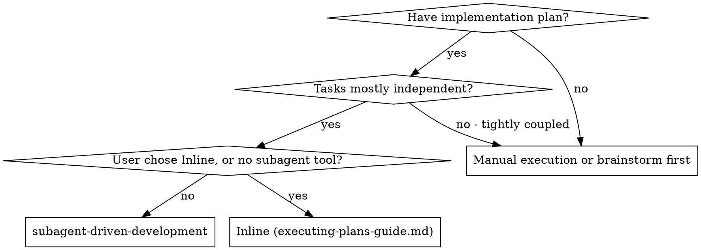
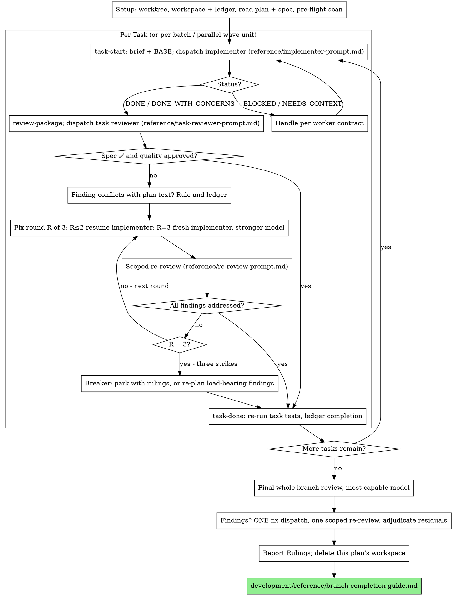

# Subagent-Driven Development

Adapted from obra/superpowers `subagent-driven-development` (MIT).

Execute a plan by dispatching a fresh implementer subagent per task, one task review (spec compliance + code quality) after each, and one broad whole-branch review at the end.

**Why subagents:** each worker gets an isolated context built from exactly what it needs — never your session history. That keeps it focused and keeps your own context free for coordination.

**Core principle:** fresh implementer per task + one task review (spec + quality) + one final whole-branch review = high quality, fast iteration.

**Worker contract:** every dispatch and every handoff in this skill follows [`development/skills/agile-development/reference/worker-contract.md`](../agile-development/reference/worker-contract.md) — the dispatch brief, the report file, the four statuses (`DONE`, `DONE_WITH_CONCERNS`, `BLOCKED`, `NEEDS_CONTEXT`), Rulings, retry rules, and recursive delegation. This skill adds only what is specific to running a plan. Where upstream superpowers and the contract differ, the contract wins.

**Narration:** between tool calls, narrate at most one short line. The ledger and tool results carry the record.

**Continuous execution:** do not pause to check in with the user between tasks. Execute every task without stopping. "Should I continue?" prompts and progress summaries waste their time; they asked you to execute the plan.

**Rulings, not stalls.** A running plan does not wait on a human. Conflicts, ambiguities, plan defects, a cap you would have asked to exceed — decide them. The spec is the binding authority, the plan is its argument, and your judgment settles what neither answers. Record every decision in the ledger in the contract's form, `Ruling: <what> — <why> — <cost if wrong>`, and keep going. A wrong ruling costs rework the user can see and undo; a session parked on a question costs their whole day.

**Four things stop you, and only these:** an irreversible or destructive operation; a security-sensitive action; a side effect outside this worktree that norms say you ask about first (a merge, a push to a shared branch, a publish, a message to anyone but the user); and a plan so broken that every path forward is a guess. For those, stop and ask.

## When to Use



**vs. Inline execution** ([`development/reference/executing-plans-guide.md`](../../reference/executing-plans-guide.md)):
- Fresh subagent per task (no context pollution) instead of one context doing every task.
- A review after each task instead of only at the end.
- Costs a fresh context per task and per review; Inline costs one context plus one final reviewer.
- Both run in this session, share the same plan workspace and ledger, and never pause between tasks. A plan can switch executors mid-flight.

## The Process



## Scripts

All helpers live in this skill's `scripts/` directory (`<skill-dir>` below). Invoke them through `bash` — packagers and Windows checkouts can strip exec bits. They are POSIX bash and need `git` on `PATH`.

| Script | Does |
| --- | --- |
| `bash <skill-dir>/scripts/sdd-workspace PLAN_FILE` | Prints this plan's git-ignored workspace, `<repo-root>/.sdd/<plan-basename>/`. |
| `bash <skill-dir>/scripts/task-start PLAN_FILE N` | Writes Task N's brief into the workspace; prints `brief: <path>` and `base: <sha>`. |
| `bash <skill-dir>/scripts/task-brief PLAN_FILE N` | Brief only (used by `task-start`; call directly when composing a batch). |
| `bash <skill-dir>/scripts/review-package PLAN_FILE BASE HEAD` | Writes commits + stat + `-U10` diff to one file; prints its path. Rejects empty or non-descendant ranges (exit 3). |
| `bash <skill-dir>/scripts/task-done PLAN_FILE N BASE -- <test cmd>` | Runs the tests, logs full output, and appends `Task N: complete (...)` to the ledger only on success. |

## Setup

Work in an isolated branch or worktree ([`development/reference/git-worktrees-guide.md`](../../reference/git-worktrees-guide.md)). Never start implementation on main/master without the user's explicit consent.

Conversation memory does not survive compaction. Controllers that lost their place have re-dispatched entire completed task sequences — the single most expensive failure observed. Track progress in a **ledger file**, not only in todos.

- **Workspace.** Run `sdd-workspace PLAN_FILE`. The printed directory holds every artifact for THIS plan: ledger, briefs, reports, review packages, test logs. Another plan's directory is never yours to read or write.
- **Resume.** Check `<workspace>/progress.md`. If its first line names your plan file, every task with a `Task <N>: complete` line is DONE — do not re-dispatch it; resume at the first task without one. A task whose last line is a fix round is mid-loop: resume at the next round. A ledger naming a different plan is another plan's progress; leave it.
- **Create** the ledger with its identity as the first line: `# SDD ledger — plan: <plan file path>`. When a caller (for example `development:agile-development`) already keeps a ledger, record a pointer to this one there instead of copying lines.
- **Trust order after compaction:** ledger and `git log` over your own recollection. The commits it names exist even when your context no longer remembers them.
- `git clean -fdx` destroys the workspace (it is git-ignored scratch). If that happens, recover from `git log`.

Read the plan once, note its context and Global Constraints, and create a todo per task. If the plan names a `Spec:`, read that too: the spec is the authority the plan argues from. A plan with no reachable spec gets a ledger note saying so — rulings made without one are provisional. If the user explicitly asked for TDD (opt-in), ledger it as a Ruling and pass it in every implementer's and reviewer's `[RULINGS]`.

**Pre-flight conflict scan.** Before dispatching Task 1, scan the plan once and write down what you checked as you check it:

- Tasks that contradict each other or the plan's Global Constraints.
- Anything the plan mandates that the review rubric treats as a defect (a test that asserts nothing, verbatim duplication of a logic block).

The scan's output is a table, not a verdict. One row per pair of tasks that share a file or an interface (use each task's Interfaces block): the two tasks, what one produces against what the other consumes, and what you found. One row per task: whether its own text agrees with itself — the tests it specifies against the code it specifies, the files it creates against the files it later touches. "The scan is clean" without those rows is not a scan you ran.

Write the table to the ledger. Rule on every conflict before execution begins, record each ruling beside its row, then dispatch Task 1. The same table tells you which tasks may run as a parallel wave (see The Task Loop). The review loop remains the net for conflicts that only emerge from implementation.

## Model Selection

Use the least powerful model that can handle each role. **Always state the model explicitly on every dispatch** — implementer, reviewer, re-reviewer, fixer, final reviewer. An omitted model inherits your session's model, usually the most expensive, and silently defeats this section.

| Role | Tier (Claude Code example) |
| --- | --- |
| Implementer: plan text contains the complete code (transcription + tests), or a single-file mechanical fix | Cheapest (`haiku`) |
| Implementer: working from prose, multi-file integration, debugging | Standard (`sonnet`) |
| Implementer: design judgment or broad codebase understanding | Most capable (`opus`) |
| Task reviewer | Scaled to diff size, complexity, and risk; standard is the floor |
| Scoped re-review of a small fix diff | Cheap-to-standard |
| Fix round 3 (fresh implementer) | At least one tier above the implementer that got stuck |
| Final whole-branch review | Most capable, never the session default |

**Turn count beats token price.** The cheapest models routinely take 2-3× the turns on multi-step work and cost more overall. Use standard as the floor for reviewers and for implementers working from prose.

## The Task Loop

**Hand artifacts over as files.** Everything you paste into a dispatch — and everything a subagent prints back — stays resident in your context and is re-read every later turn. Briefs, diffs, and reports move as file paths. Never make a subagent read the whole plan file.

**Batch small same-shape work.** When several tasks are each a small, independent edit of the same kind — the same one-line fix, constant change, or field addition across files — send ONE dispatch listing every file and its change, and review its diff as one unit. Reserve one-dispatch-per-task for work that needs its own judgment, tests, or review surface.

**Parallel implementers only when the coupling check passes.** Tasks may run as a parallel wave only when [`development/skills/agile-development/reference/parallel-waves.md`](../agile-development/reference/parallel-waves.md) marks every pair **parallel** (no shared contract, schema, manifest/lock/generated file, runtime resource, or hidden write surface). Its wave contract applies: at most 5 concurrent writers, a recorded base, one owner per file, and no commits by workers in a shared tree — in a shared tree you integrate one unit at a time in dependency order, committing only that unit's owned files, then review each unit with its own `review-package` range. Anything that fails the check runs in sequence.

**Waiting on subagents.** Never poll with short timeouts, and never sit in one silent open-ended wait. While you have local work (ledger updates, packaging the next review, reading reports), do it. When idle, wait in bounded stretches of five to ten minutes; between stretches post one status line and reconcile live children, chasing any that finished without reporting.

### 1. Dispatch the implementer

- Run `task-start PLAN_FILE N`. It writes the brief and prints BASE — the commit the task's review range is cut from. The review package and fix diffs need it; never use `HEAD~1`, which drops all but the last commit of a multi-commit task.
- Build the dispatch from the contract's eight brief parts using [reference/implementer-prompt.md](reference/implementer-prompt.md): goal (one line on where the task fits), inputs (the brief path — "read this first; it is your requirements, with exact values to use verbatim"), owned artifacts, acceptance, out of scope, model, stop condition, report file.
- Also include: interfaces and decisions from earlier tasks the brief cannot know; your resolution of any ambiguity you noticed; a pointer to any ledger entry (ruling or parked finding) in the area this task touches.
- Exact values (numbers, magic strings, signatures, test cases) appear only in the brief. `task-brief` puts the plan's Global Constraints section ahead of the task text, so shared values arrive with every task.
- **Report file:** name it after the brief (`…/task-N-brief.md` → `…/task-N-report.md`).
- A dispatch describes one task, not the session's history. Do not paste prior-task summaries; a real session's dispatch hit 42k chars, 99% pasted history.
- **Recursive delegation:** the implementer may start its own sub-agents only for an independent, sizeable part of its task, under the contract's Recursive delegation rules (children get a full brief, a subset of the owned files, and are verified by the implementer before it reports). It never spawns a reviewer of its own work — the task review is already scheduled, and a worker-spawned reviewer is a duplicate seat whose approval counts for nothing.
- Record the implementer's agent identity from the dispatch result; fix rounds 1-2 resume it.

### 2. Handle the report

Act on the status exactly as the contract's status table says. SDD specifics:

- **DONE:** run `review-package PLAN_FILE BASE HEAD` and dispatch the task reviewer with the printed path.
- **DONE_WITH_CONCERNS:** read the concerns. Correctness or scope concerns are resolved (as a Ruling or a follow-up task) before review; observations ("this file is getting large") are noted and review proceeds.
- **NEEDS_CONTEXT:** send the named input to the same running implementer.
- **BLOCKED:** classify with the contract's Retry rules table and change the configuration — more context, a stronger model, a smaller task, or a ruled plan correction carried in the dispatch. A retry with an unchanged brief is banned.

If the implementer asks questions, before starting or mid-task, answer clearly and completely and do not rush it into implementation.

### 3. Review the task

Per-task reviews are task-scoped gates; the broad review happens once, at the end. Never skip the task review, and never accept a report missing either verdict — spec compliance AND task quality are both required. Implementer self-review never replaces it.

- **Reviewer inputs:** three paths — the same brief, the report file, the review package — plus the global constraints that bind the task, copied verbatim from the plan's Global Constraints (and, where relevant, its Review Focus). Never dispatch a task reviewer without a diff file. Template: [reference/task-reviewer-prompt.md](reference/task-reviewer-prompt.md).
- Do not add open-ended directives ("check all uses", "run race tests if useful") without a concrete, task-specific reason.
- Do not ask the reviewer to re-run tests the implementer already ran on the same code; the report carries that evidence.
- **Never pre-judge findings.** If the prompt you are writing contains "do not flag", "don't treat X as a defect", "at most Minor", or "the plan chose" — stop: you are pre-judging, usually to spare yourself a loop. Let the reviewer raise it; adjudicate it in the loop.
- **⚠️ Cannot verify from diff** items do not block the review, but you resolve each yourself before completing the task: you hold the cross-task context. A confirmed gap enters the fix loop.
- **Recursive delegation:** the reviewer may start sub-agents only to split an independent, sizeable part of a large diff, under the contract's rules. It never spawns a second-opinion reviewer.

### 4. The fix loop

The loop triggers on spec ❌, any Critical or Important finding, or a ⚠️ item you confirmed as a real gap. Two routes leave it first:

- **Minor findings** go to the ledger as `Task <N>: minor (deferred): <one-liner>` and never enter the loop. The final review triages that list.
- **Plan-mandated or plan-conflicting findings** are yours to rule on against the spec. Ledger the ruling before acting. Never dismiss a finding because the plan mandates it, and never dispatch a fix that contradicts the plan without a recorded ruling.

A fix round is one fix dispatch plus one scoped re-review. The budget follows the contract's Retry rules, **three rounds per task**:

- **Rounds 1-2 — resume the original implementer** with the open findings verbatim. Its context is intact. If your harness cannot message a live subagent, dispatch a fresh one on the same model carrying the brief path, the report-file path, and the findings — the report file is the persistent memory either way.
- **Round 3 — fresh implementer on a stronger model** (see Model Selection), with the brief, the report file, the open findings, and this framing: "A prior implementer attempted this task twice; you own it now. Read the report file for what was tried."
- **Every round:** the implementer fixes, re-runs the tests covering the amended code, appends a fix report (tests, command, output) to the same report file, and returns the short contract. Confirm all three are present before the re-review. Name the covering test files in the fix message.
- **Scoped re-review:** run `review-package PLAN_FILE FIX_BASE HEAD` (FIX_BASE = the head the previous review saw) and dispatch [reference/re-review-prompt.md](reference/re-review-prompt.md) with the findings, brief, report file, and diff path. New Critical/Important breakage in the fix diff joins the open list. Out-of-scope observations go to the ledger as deferred minors; they never extend the loop.
- **After each round,** append: `Task <N>: fix round <R>/3 (<X> addressed, <Y> open — <one-liners>; commits <a7>..<b7>)`.
- Never fix findings yourself in the controller session: your context stays clean, and controller fixes skip review.

**The breaker (three strikes).** When round 3's re-review still leaves findings open, stop dispatching fixes and adjudicate each open finding:

- **Reviewer wrong or point contestable** → `Task <N>: parked — <finding> — Ruling: <why the code stands> — <cost if wrong>`. The final review sees both sides.
- **Real, but nothing downstream builds on it** → park it the same way, with a ruling that says it is real and deferred.
- **Real and load-bearing** (a later task builds on it, or it reveals a plan defect) → re-plan, as the Agile **Three strikes** alarm requires: record what was learned, rule on the smallest change that unblocks the dependent work (split the task, change the approach, or correct the plan), ledger it as `Task <N>: Ruling: <finding> — <decision> — <cost if wrong>`, and carry it into the next dispatch. Stop only when every path forward is a guess.

Adjudicate only at the cap; adjudicating earlier to end a loop is pre-judging under another name. Every adjudication is a ledger entry — silent discards are forbidden.

### 5. Complete the task

When the review is clean — or every open finding is parked or re-planned with a ruling at the cap — close the task with `task-done PLAN_FILE N BASE -- <the task's focused test command>`. This is the contract's "re-run at least one claimed check yourself": it re-runs the implementer's tests, keeps the output in the workspace (never in your context), and appends `Task <N>: complete (commits <base7>..<head7>, tests: <cmd> → <result>)` only on success. A failing run records nothing: route it back to the implementer as a finding. In the same message, append the review outcome (`Task <N>: review clean` or `Task <N>: <K> parked`) and mark the todo complete.

Never move to the next task while the review has open Critical/Important findings that are neither fixed nor ruled on at the cap.

## Final Review

Run `review-package PLAN_FILE MERGE_BASE HEAD` (MERGE_BASE = the commit the branch started from, e.g. `git merge-base origin/main HEAD`). Dispatch the `code-reviewer:code-reviewer` agent (it applies `code-reviewer:pr-review`) **on the most capable model**, with: the package path, the plan and spec paths, the plan's Review Focus section verbatim, and pointers to the ledger's `Ruling:`, `parked`, and `minor (deferred)` lines so it can triage which must be fixed before merge.

If it returns findings, dispatch ONE fix subagent with the complete findings list — not one fixer per finding; a real session's per-finding fix wave cost more than all its tasks combined. Then run exactly one scoped re-review of the fix range. Adjudicate residual findings as in the breaker: park with rulings, or rule on load-bearing ones and ledger the decision. There is no second fix wave; residual load-bearing findings reach the user through the branch-completion options.

## Finish

Before deleting anything, collect every ledger line containing `Ruling:` — pre-flight rulings, parked findings, breaker adjudications, final-review residuals — into your final message under **"Rulings I made"**, in order, each with its cost if wrong, and every `minor (deferred)` line under **"Deferred minors"**. Both lists are exhaustive. They are the only place the decisions you took on the user's behalf reach them; a ruling that dies with the workspace was a decision made in secret.

When the final review is clean and its fixes are committed, delete this plan's workspace (`rm -rf <workspace>`) — git history is the record now. Sibling directories belong to other plans; leave them alone.

Then follow [`development/reference/branch-completion-guide.md`](../../reference/branch-completion-guide.md).

## Common Rationalizations

| Excuse | Reality |
| --- | --- |
| "Close enough on spec compliance" | Reviewer found spec gaps = not done. Fix, or hit the cap and adjudicate — the only exits. |
| "I'll fix it myself, dispatching is overhead" | Controller fixes pollute your context and skip review. Resume the implementer. |
| "One more round will converge" | Past round 3 the failure is structural. Adjudicate and re-plan. |
| "The reviewer will just find something new anyway" | Scoped re-reviews verify fixes; they cannot wander. New findings on untouched code go to the ledger, not the loop. |
| "This finding is obviously wrong, I'll drop it" | You adjudicate only at the cap, and every ruling is a ledger entry. |
| "The fix was small, skip the re-review" | Unreviewed fixes are how regressions land. Every round ends with a scoped re-review. |
| "Ledger bookkeeping is overhead" | The ledger is what survives compaction. Controllers without one re-dispatched whole completed sequences. |
| "These tasks touch different files, run them in parallel" | Different files are not independence. Run the parallel-waves coupling check first. |
| "The implementer spawned its own reviewer — extra assurance" | A duplicate seat on the same diff. Sub-agents are for dividing independent work, not for reviewing it again. |
| "I'll skip naming the model this once" | The unnamed model is the most expensive one. Every dispatch names its model. |

## Example Workflow

```text
You: I'm using Subagent-Driven Development to execute this plan.

[Worktree verified; plan + spec read once]
[sdd-workspace docs/plans/feature-plan.md → no ledger, fresh start]
[Pre-flight: 2 shared-interface rows, 4 self-consistency rows, 1 ruling; written to ledger]

Task 1: Hook installation script
[task-start plan 1 → brief, BASE a1b2c3d; dispatch implementer, model: haiku (plan has full code)]
Implementer: STATUS: DONE — 1 commit, 5/5 passing, report: .sdd/feature-plan/task-1-report.md
[review-package plan a1b2c3d HEAD; dispatch task reviewer, model: sonnet]
Reviewer: Spec ✅. Issues: none. Task quality: Approved.
[task-done plan 1 a1b2c3d -- npm test -- hooks → ledger: Task 1: complete (...); Task 1: review clean]

Task 2: Recovery modes
[task-start plan 2 → BASE d4e5f6a; dispatch implementer, model: sonnet]
Reviewer: Spec ❌ missing progress reporting; Important: magic number 100
[Fix round 1: resume implementer with both findings → fix report appended]
[review-package plan <fix-base> HEAD; scoped re-review, model: haiku → both ADDRESSED]
[Ledger: Task 2: fix round 1/3 (2 addressed, 0 open; commits d4e5f6a..b7c8d9e)]
[task-done plan 2 d4e5f6a -- npm test -- recovery → complete; review clean]

...

[review-package plan MERGE_BASE HEAD; code-reviewer:code-reviewer, model: opus]
Final reviewer: ready to merge; deferred minors triaged, none block.
[Final message: Rulings I made + Deferred minors; delete workspace]
[Follow development/reference/branch-completion-guide.md]
```

## Integration

- **Worker contract:** `development/skills/agile-development/reference/worker-contract.md`; parallel safety: `development/skills/agile-development/reference/parallel-waves.md`.
- **Workspace:** `development/reference/git-worktrees-guide.md`.
- **Plan source:** `development/reference/writing-plans-guide.md` (Global Constraints, Review Focus, Interfaces, Execution Handoff).
- **Inline alternative:** `development/reference/executing-plans-guide.md` (same workspace, ledger, and scripts).
- **Implementers use:** `development:scenario-driven-development` (scenario by hand → regression tests → coverage-guided tests), `development:verification-before-completion`, `debugging:systematic-debugging`. Use `development:test-driven-development` only when the user explicitly asks for TDD.
- **Final review:** `code-reviewer:code-reviewer` agent / `code-reviewer:pr-review`.
- **Finish:** `development/reference/branch-completion-guide.md`.
